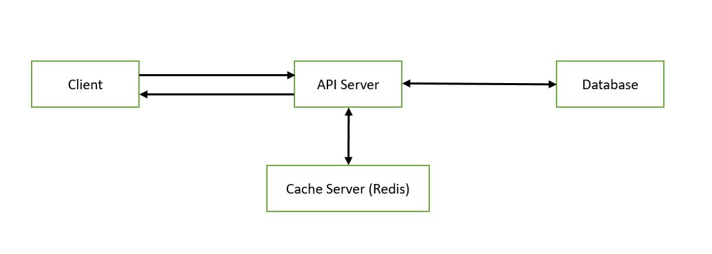

# RedisCacheApp

## Description

RedisCacheApp is a full stack application combining with a frontend named 'client' and a backend named 'apiServer'. MongoDb is used for the database and Redis is used for the chache server. When a data is searched from the client end, the apiServer checks the Redis cache. If it finds in cache, then responds with the data. If it does not find in cache, then searches the database and if the data is found, it responds with the data. This time it saves the data in cache.

## Table of Contents

- [Installation](#installation)
- [Configuration](#configuration)
- [Run](#run)
- [Test](#test)
- [Troubleshooting](#troubleshooting)
- [License](#license)

## Installation

To install it, follow these steps:

1. Install node js
2. Run a Redis server. To know more, [click](https://redis.io/) here.
3. Clone the repository
4. Create a database in MongoDb atlas. To know more, [click](https://www.mongodb.com/atlas/database) here.

## Configuration

1. Configure the redis server to run at the default port (6379).
2. Change the variable DB_URL in .env file, with MongoDB connection string. The .env file can be found in 'apiServer' folder.

## Run

1. To start the apiServer, use the command `cd apiServer ` and then `npm run dev `. It will start running at port 3001
2. To start the client, use the command `cd client ` and then `npm start `. It will start running at port 3000

## Test

1. Open a browser and go to http://localhost:3000/
2. Test creating, searching and deleting notes. Only searching is associated with the cache server.
3. To search, enter the id provided by the MongoDB `_id`, in the input field.

## Troubleshooting

1. To check the api server is working or not, Open a browser and go to http://localhost:3001/
2. To run the client app in windows machine, a compile error may come at first. To solve it, open the package.json file in client folder and simply pres `ctrl + s`

## License

This project is provided under a free license but is intended for educational and learning purposes only. It is not recommended for use in production environments. The authors of this project do not assume any responsibility for its usage outside of learning and educational contexts.
